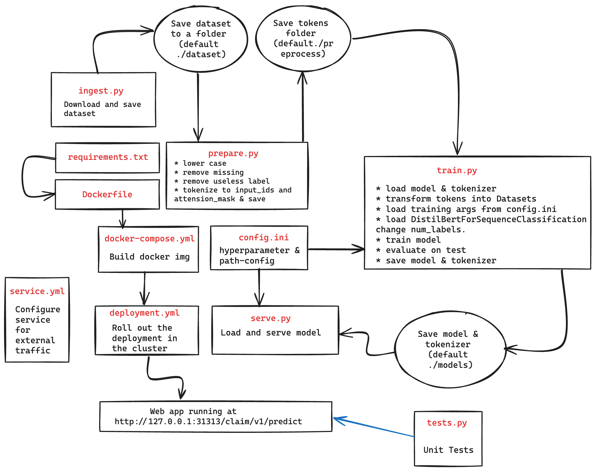

## Demo
[Ingest](https://drive.google.com/file/d/1VoPQCBEjoruc1Xzo_2eIxwbeuKEq9pVL/view?usp=drive_link) | [Prepare](https://drive.google.com/file/d/1XrTX_vEHaEU13-_8K7XXR7VdrjF_k8Uy/view?usp=drive_link) | [Train](https://drive.google.com/file/d/18gTLxFZ0-eL0ccuRrO_bcp5FvDbGmzev/view?usp=drive_link) | [Deployment](https://drive.google.com/file/d/1YzRnRjimfHFNxgXrepLZkvZA9xUKvkvY/view?usp=drive_link) | [Tests](https://drive.google.com/file/d/1UjS09EXLbD-3dGrFGuEZZhvzj-dY2fMK/view?usp=drive_link)

## Project Structure
<pre>
.  
├── ingest.py                Script for downloading and saving the dataset.           
├── prepare.py               Script for processing the dataset for training.              
├── train.py                 Script for fine-tuning the model.  
├── config.ini               Configuration file for setting model hyperparameters and paths                      
├── serve.py                 FastAPI application for serving the model.                    
├── Dockerfile               Docker configuration for containerizing the FastAPI application.   
├── docker-compose.yml       Docker Compose configuration for container application.  
├── service.yml              Kubernetes Service configuration.   
├── deployment.yml           Kubernetes deployment configuration.  
├── tests.py                 Unit tests for the FastAPI application.     
├── requirements.txt         Python package dependencies.  
├── .gitignore               Git ignore file to exclude unnecessary files from version control.  
└── README.md                Project documentation. 
</pre>
### Design

## Steps to Run the Project
### 0. Pre-requisite
Install dependencies
```
pip3 install -r requirements.txt
```
### 1. ingest.py

```
usage: ingest.py [-h] [--path PATH]

Download and save the ImperialCollegeLondon/health_fact dataset.

optional arguments:
  -h, --help   show this help message and exit
  --path PATH  Path to save the dataset (default: ./dataset)
```

Run `python3 ingest.py` or `python3 ingest.py --path=your_path`

### 2. prepare.py

```
usage: prepare.py [-h] [--dataset-path DATASET_PATH] [--preprocess-path PREPROCESS_PATH]

Preprocess and tokenize datasets.

optional arguments:
  -h, --help            show this help message and exit
  --dataset-path DATASET_PATH
                        Path to the dataset directory(default: ./dataset)
  --preprocess-path PREPROCESS_PATH
                        Path to save preprocessed tokens(default: ./preprocess)
```

Run `python3 prepare.py` or `python3 prepare.py --dataset-path=your_path --preprocess-path=save_path`

### 3. train.py

```
usage: train.py [-h] [--preprocess-path PREPROCESS_PATH] [--store-model STORE_MODEL]

Train DistilBert Model

optional arguments:
  -h, --help            show this help message and exit
  --preprocess-path PREPROCESS_PATH
                        Path to retrieve preprocessed tokens(default: ./preprocess)
  --store-model STORE_MODEL
                        Path to save trained weight & tokenizer(default: ./models)
```
Run `python3 train.py` or `python3 train.py --preprocess-path=your_path --store-model=save_path`

### 4. Deployment
```
docker-compose build              # Build image 
kubectl apply -f service.yml      # Configure service for external traffic
kuberctl apply -f deployment.yml  # Roll out the deployment in the cluster
```

### 5. Tests
Run `pytest tests.py` or `python3 -m pytest tests.py`

### Questions
Q: How would you go about deciding which model to use? Select a model and we will use it to be deployed.  
Ans: Since the length of tokens in train, test and validation test never reaches 512 I decided to ahead with DistilBert also It is faster to train and experiment with(considering the limited time that I had). If can track sequence length of deployed model collect those and token length are more that 512, we can train longformers(or use chucking)

Q: How would you evaluate this new fine-tuned model? How would you optimise this model further?  
Ans: Accuracy, Precision (in case of costly FP), recall(if FN are costly), F1-score (for a balance between FP and FN).  

For further optimization: 
* We can do hyperparameter tuning (with `optuna`)
* Perform output probability calibration 
* Use difference loss function(class weighted CE)
* Improve Training Pipeline, using Early Stopping, Weight Initialization after classfication layer(after pooler_output) etc. 

Q: Explain in a few sentences how you would monitor this model and decide when to make updates (e.g. retrain).
Ans: 

Track model performace metric i.e Accuracy, Precision, Recall, F1-score using `prometeus` and `grafana`, trigger retraing if metric are significantly poor that expectation. Capture Data and concept drift re-training the model if significant drift is detected.